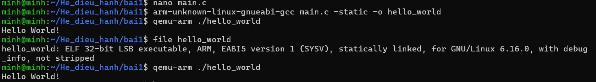

# Hệ Điều Hành Nhúng

### Bài 1

##### 1. Cài đặt crosstool-NG

Tải crosstool-NG
```bash
wget http://crosstool-ng.org/download/crosstool-ng/crosstool-ng-1.28.0.tar.bz2
```
Giải nén toolchain
```bash
tar xf crosstool-ng-1.28.0.tar.bz2
cd crosstool-ng-1.28.0/
```

Tải các package cần thiết cho toolchain
```bash
sudo apt install build-essential git autoconf bison flex texinfo help2man gawk \ 
libtool-bin libncurses5-dev unzip build-essential

sudo apt install make
```

Cài đặt cho crosstool-NG
```bash
./configure --prefix=/usr/local
make
sudo make install
```

Build toolchain

```bash
./ct-ng build
```

Kiểm tra toolchain
```bash
export PATH=$HOME/x-tools/arm-training-linux-musleabihf/bin:$PATH
arm-training-linux-musleabihf-gcc --version
```

##### 2. Viết 1 chương trình C đơn giản. Sử dụng Cross Toolchain ở mục 1. biên dịch thành công chương trình C. Dùng lệnh file hoặc readelf để xác nhận thông tin đã biên dịch chéo

Tạo 1 file code c

```bash
nano main.c
```

Copy đoạn code C sau vào file main.c vừa tạo

```bash
#include <stdio.h>

int main(void) {
    printf("Hello World!\n");
    return 0;
}
```

Build code trên với crosstool-NG và biên dịch chương trình
```bash
arm-unknown-linux-gnueabi-gcc main.c -o hello_world
```

Check file vừa được tạo ra
```bash
file hello_world
```

##### 3. Load file đã biên dịch vào QEMU và chạy thử

Load file và chạy thử với qemu
```bash
qemu-arm ./hello_world
```

Kết quả 

